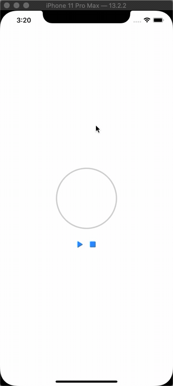

# CoCentricCircleAnimationView

## Introduction

[CoreAnimation](https://developer.apple.com/library/archive/documentation/Cocoa/Conceptual/CoreAnimation_guide/Introduction/Introduction.html#//apple_ref/doc/uid/TP40004514-CH1-SW1) 및 [UIBezierPath](https://developer.apple.com/documentation/uikit/uibezierpath)의 사용법 예제로, 동심원 애니메이션을 구현한 프로젝트입니다. 



## Example

To run the example project, clone the repo, and run `pod install` from the Example directory first.

## Installation

CoCentricCircleAnimationView is available through [CocoaPods](https://cocoapods.org). To install
it, simply add the following line to your Podfile:

```ruby
pod 'CoCentricCircleAnimationView'
```

## Author

e-sung, dev.esung@gmail.com

## License

CoCentricCircleAnimationView is available under the MIT license. See the LICENSE file for more info.
